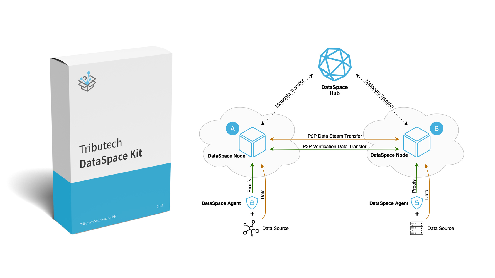

# Tribtuech DataSpace Kit API clients

A collection of API clients for easy access to the DataSpace Kit.



## Usage of .NET Core client

Requires netstandard2.0 or higher.

``` csharp
var authHandler = new APIAuthHandler(tokenUrl, scope, clientId, clientSecret);
var authorizedHttpClient = new HttpClient(authHandler))
var apiClient = new DataAPIClient(nodeUrl, authorizedHttpClient);

// Get values within the last 7 days
ICollection<ReadValueDoubleModel> data = await apiClient.DoubleAllAsync(dataStreamId, DateTime.Now, DateTime.Now.AddDays(-7), "asc", null, null, null);
```