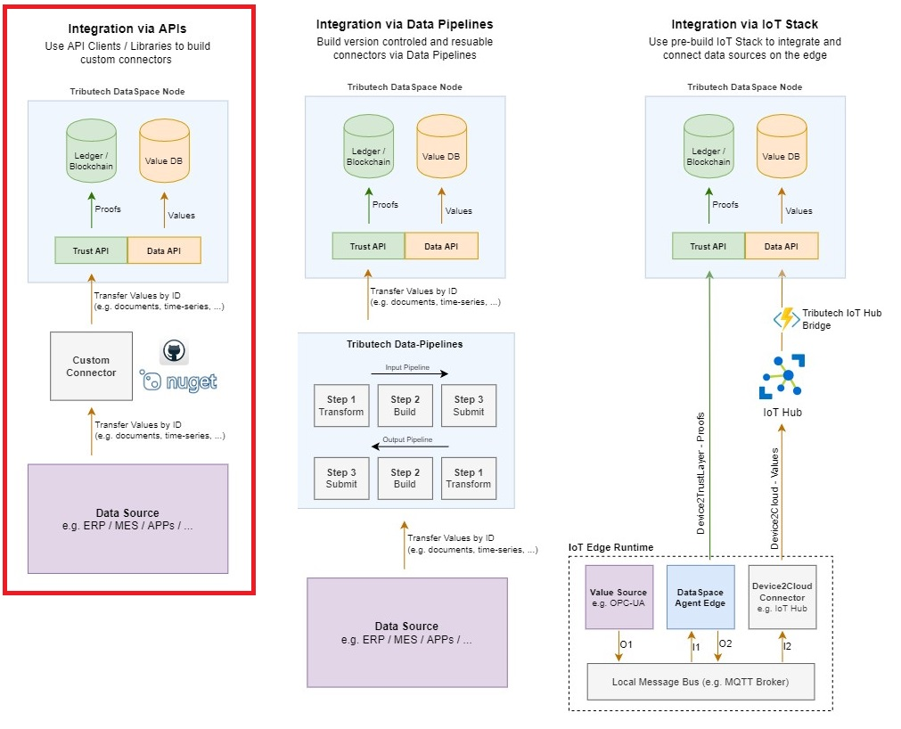

# Tributech DataSpace Kit API clients

This repository contains a collection of API clients for easy access to the Tributech DataSpace Kit.

--- 

## Available Api Clients
The following clients are available:

| Framework / Language | Package | Release version | Usage | Examples |
|-|-|-|-|-|
| .NET Core / C# | Nuget: [Tributech.Dsk.Api.Clients](https://www.nuget.org/packages/Tributech.Dsk.Api.Clients) |  | [Usage](./clients/netcore) | [Example](./examples/netcore)

---

## Integration via APIs
The clients can be used to create a custom connector to connect a data source to the relevant Tributech Dataspace Kit endpoints. The clients help in achieving the goal of integrating data sources via the Tributech Dataspace Kit APIs, namely the Data Api and Trust Api, as seen in the image below (marked with the red rectangle).

---

## API Guide
The Tributech DataSpace Kit provides two APIs:
 - Data Api
 - Trust Api

**In short, the Data Api is used for values whereas the Trust Api is used for proofs. The Trust Api however also offers some endpoints which integrate the Data Api.**

----

*A few cases which should help to understand when to use which Api are explained following.*

### Store values
**Unless the proofs are created directly on an external device** (e.g. DataSpace Agent Edge), the **Trust Api** should be used to store values and automatically create and persist the respective proofs. The `/value` and `/values` HTTP POST endpoints of the Trust Api can be used to do so. 

**If however the proofs are created separately**, then the `/value` and `/values` HTTP POST endpoints of the **Data Api** can be used to only store values - the proofs are then stored manually through the `/proof` and `/proofs` HTTP POST endpoints of the Trust Api.

### Get values
The **Data Api** provides various `/values` HTTP GET endpoints to fetch values.
Values can also be retrieved together with the respective proof through the `/proofvalues` HTTP GET endpoint of the Trust Api.

*Note: The Data Api also handles the syncing of values between DataSpace Nodes (as far as approved through the parties). The status for this syncing process is available through the Status endpoints of the Data Api.*

### Store proofs
The **Trust Api** `/proof` and `/proofs` HTTP POST endpoints can be used to store proofs. 

*Note: Each proof is stored tamperproof within the Distributed Ledger (Blockchain) across the Tributech DataSpace network. Consequently, each proof is assigned a unique TransactionId - which can be used to fetch the proof from the Ledger. This endpoint to retrieve the proof from the Blockchain is called ProofLocation and can be accessed through the available endpoints in the DataApi.*

### Get proofs
Proofs can be fetched through the `/proof` HTTP GET endpoint of the **Trust Api**. A proof can also be retrieved together with the assigned values through the `/proofvalues` HTTP GET endpoint of the Trust Api.

### Validate proofs
A proof can be validated through the `/validate/proof` HTTP POST endpoint of the **Trust Api**.

----
  
## Usage
Usage examples for the clients are available in [/examples](./examples).

You can inspect the availabe endpoints for the Data Api and Trust Api through Swagger. Please follow the guide on [docs.tributech.io](https://docs.tributech.io/apis/apis-data-api/).

---

## Contribute 
Please report any bugs / issues that you find, thank you!

---

## Need Support?
Use the [Tributech Support Center](https://tributech.atlassian.net/servicedesk/customer/portals).